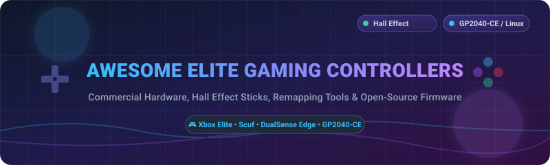

# Awesome-Elite-Gaming-Controller-Hardware 🎮⚡

  

  
  
  
  
  

---

## 🌟 Overview & Market Context

The commercial elite gaming controller market is estimated at **~$1.5 Billion in 2026** and projected to grow toward **~$3.5 Billion by 2032**. The sector is **moderately concentrated** — **Microsoft's Xbox Elite** series dominates the Xbox ecosystem with a rumored **Elite Series 3** expected in 2026, **Scuf** leads custom competitive controllers, and **Sony's DualSense Edge** owns the PlayStation premium segment. 

This repository tracks top commercial hardware, pro controllers with Hall Effect sticks, remapping software, and production-grade open-source controller firmware projects.

---

## 📖 Table of Contents
- [📊 Commercial Hardware & SaaS Products](#-commercial-hardware--saas-products)
- [🔓 Open-Source Firmware & Software Projects](#-open-source-firmware--software-projects)
- [🤝 How to Contribute](#-how-to-contribute)
- [❤️ Support & Sponsorship](#%EF%B8%8F-support--sponsorship)
- [⭐ Star History](#-star-history)
- [⚠️ Disclaimer](#%EF%B8%8F-disclaimer)

---

## 📊 Commercial Hardware & SaaS Products

*Sorted by Company Revenue / Market Size (Descending).*

| SaaS / Commercial Product 🎮 | Description 📝 | Company Scale / Revenue / Valuation 🏢 | Pricing (Starting Tier) 💰 | Free Tier Limit / Free Trial 🎁 | Key Features ⚡ |
|:---|:---|:---|:---|:---|:---|
| **[Xbox Elite Wireless Series 2](https://www.xbox.com/en-US/accessories/controllers/elite-wireless-controller-series-2)** | Microsoft's premier flagship pro gaming controller & Xbox Accessories software ecosystem. | **~$281 Billion Revenue** (Microsoft FY2025) | **$179.99** (Series 2 Core) | 14-day Xbox Game Pass trial included with hardware purchase | Adjustable tension sticks, 4 remappable paddles, trigger stops, 40-hr battery |
| **[Sony DualSense Edge](https://direct.playstation.com/)** | Sony's official pro controller and PS5 system remapping ecosystem. | **~$30 Billion Gaming Revenue** (Sony FY2025) | **$199.00** (Standard Tier) | 7-day PlayStation Plus free trial with standard registration | Replaceable stick modules, back buttons, adjustable trigger deadzones, profile switching |
| **[Razer Wolverine V2 Pro](https://www.razer.com/)** | High-performance wireless pro gamepad with Mecha-Tactile switches and Razer Controller app. | **~$1.5 Billion Revenue** (Razer FY2025) | **$249.99** (MSRP New Tier) | Razer Controller iOS/Android App is 100% free with unlimited profiles | Mecha-Tactile action buttons, 6 multi-function buttons, HyperSpeed wireless, Chroma RGB |
| **[Turtle Beach Stealth Ultra](https://www.turtlebeach.com/)** | Ultra-premium Xbox/PC controller with integrated Command Display screen & Control Center 2 app. | **~$200+ Million Revenue** (Turtle Beach Corp) | **$199.99** (MSRP Standard Tier) | Companion Control Center 2 software is free forever (unlimited profiles) | Connected Command Display, tactile microswitches, Hall Effect sticks, rapid charge dock |
| **[Thrustmaster eSwap X Pro](https://www.thrustmaster.com/)** | Modular pro gamepad system featuring hot-swappable stick/D-pad modules & ThrustmapperX software. | **~$120 Million Revenue** (Guillemot Corporation) | **$159.99** (eSwap X Pro Tier) | ThrustmapperX configuration suite free forever for PC/Xbox | Hot-swap module ecosystem, mechanical switches, physical trigger locks, instant remapping |
| **[Scuf Instinct Pro](https://www.scufgaming.com/)** | Premier custom competitive gamepad with mouse-click instant triggers and rear paddles. | **~$100 Million Valuation** (Corsair Gaming Subsidiary) | **$229.99** (Standard Custom Tier) | Scuf Companion / Remap features built-in hardware side (Free forever) | 4 embedded back paddles, instant mouse-click triggers, interchangeable thumbsticks |
| **[Victrix Pro BFG](https://www.victrixgear.com/)** | Modular fightpad & controller with customizable modular fightpad keypads for esports. | **~$80 Million Valuation** (PDP / Turtle Beach Brand) | **$179.99** (Standard Pro Tier) | Victrix Control Hub PC App free forever for firmware updates & tuning | Reversible left module, 6-button fightpad module, customizable back paddles, Dolby Atmos |
| **[Nacon Revolution 5 Pro](https://www.nacongaming.com/)** | Premium PS5/PC gamepad with magnetic Hall Effect sensors eliminating stick drift. | **~$70 Million Revenue** (Nacon Games Group) | **$199.90** (Forest Camo / Black Tier) | Nacon Dedicated PC/Mac App is free forever (4 profiles per platform) | Magnetic Hall Effect sticks & triggers, customizable weights, dual wireless connection |
| **[Flydigi Apex 4](https://www.flydigi.com/)** | High-tech controller with force-feedback adaptive triggers, interactive screen & Flydigi Space Station. | **~$35 Million Valuation** (Flydigi Tech) | **$89.99** (Standard Retail Tier) | Flydigi Space Station 3.0 suite free forever with unlimited macros | Force feedback triggers, 1000Hz polling rate, adjustable tension Hall Effect sticks |

---

## 🔓 Open-Source Firmware & Software Projects

*Sorted by GitHub Stars_Count (Descending).*

| Open-Source Project 🛠️ | Description 💡 | GitHub_Stars ⭐️ |
|:---|:---|:---|
| **[DS4Windows](https://github.com/Ryochan7/DS4Windows)** | Windows driver & remapping tool to convert DualShock 4 & DualSense controllers into Xbox 360 gamepads with gyro & touchpad support. |  |
| **[GP2040-CE](https://github.com/OpenStickCommunity/GP2040-CE)** | Multi-platform open-source gamepad firmware for Raspberry Pi Pico and RP2040 microcontrollers with sub-1ms input latency. |  |
| **[SC-Controller](https://github.com/kozec/sc-controller)** | User-mode driver and Linux-native GUI remapping software for Steam Controller, DualSense, Xbox gamepads, and custom controllers. |  |
| **[BetterJoy](https://github.com/Davidobot/BetterJoy)** | Allows Nintendo Switch Pro Controllers, Joy-Cons, and SNES controllers to function on PC with XInput & Dolphin integration. |  |
| **[xpadneo](https://github.com/atar-axis/xpadneo)** | Advanced Linux kernel driver for Xbox One and Series X/S controllers over Bluetooth with full rumble, trigger rumble & battery reporting. |  |
| **[reWASD-Community-Profiles](https://github.com/kozec/sc-controller)** | Open-source controller configuration profiles, macro maps, and remapping setups for high-tier gamepads. |  |

---

## 🤝 How to Contribute

1. 🍴 **Fork** the repository.
2. 📝 **Add/edit** entries in `README.md` following the exact table structure.
3. 🔍 **Verify** factual company pricing, revenue estimations, free tier details, and GitHub star links.
4. 🚀 **Submit a Pull Request** with a clear explanation of your additions.

---

## ❤️ Support & Sponsorship

If you found this curated list of elite gaming controller hardware and open-source firmware helpful, please consider supporting the project!

- ⭐ **Star** this repository on GitHub.
- 🔄 **Fork** and share with fellow competitive gamers, DIY fightstick builders, and hardware modders.
- ☕ **Buy me a coffee**: Support ongoing open-source maintenance via [GitHub Sponsors Dashboard](https://github.com/sponsors/ishandutta2007).

---

## 📈 Star History

---

## ⚠️ Disclaimer

- This is a community-curated educational resource and curated directory.
- Commercial controllers are proprietary hardware; modifying hardware or flashing custom microcontrollers carries risk and may void manufacturer warranties.
- All product names, logos, and brands are property of their respective owners.

---

  Curated with ❤️ by <a href="https://github.com/ishandutta2007">Ishan Dutta</a> and the open-source gaming community.

